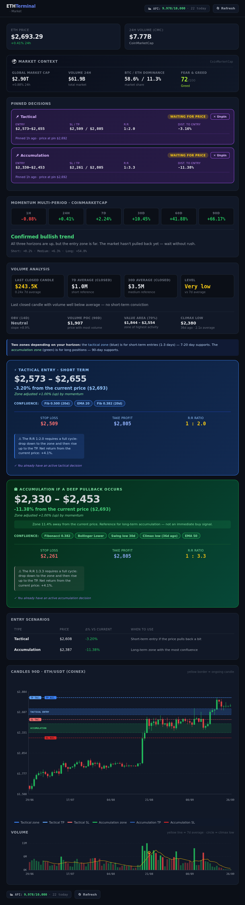
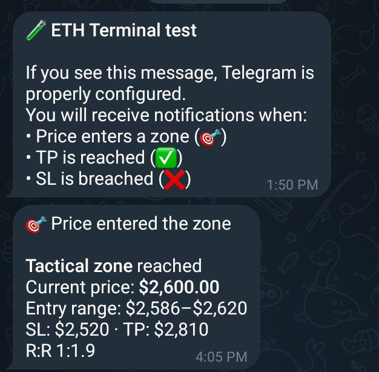

# ETH Terminal

> Technical analyzer for ETH/USDT that turns raw market data into actionable decisions — buy zones with calculated stop, take profit and R:R, plus automatic Telegram notifications.

[](https://www.python.org/)
[](https://fastht.ml/)
[](https://coinmarketcap.com/api/)
[](LICENSE)

---

## 📸 Screenshots


*Main dashboard: tactical and accumulation zones with SL/TP marked*


*Automatic notification when the price enters a zone*

---

## 🎯 What does it do?

ETH Terminal solves a specific problem: **knowing when and where to buy ETH**.

Instead of showing charts and expecting the user to interpret them, it computes two **real buy zones** with all the data needed to trade:

| Zone | Horizon | Based on |
|---|---|---|
| ⚡ **Tactical** | Short term (1-3 days) | EMA 20, swing low 10d, Fibonacci 20d, VWAP 7d |
| 🎯 **Accumulation** | Long term (weeks) | 12 methods over 90 days |

Each zone includes:
- **Entry range** exact
- **Stop loss** and **take profit** with calculated R:R
- **Confluence** — which methods coincide in that zone
- **Momentum adjustment** — shifts based on market context

When the price enters a zone you pinned, you get a **Telegram notification**. When it reaches the TP or breaks the SL, you also do.

---

## 🚀 Features

- ✅ **Two buy zones** — short and long term, not a generic one
- ✅ **12 technical methods** — Fibonacci, EMA, Bollinger, Volume Profile, OBV, VWAP, Percentiles
- ✅ **Multi-period momentum** — combines 1h, 24h, 7d, 30d, 60d, 90d into a single diagnostic
- ✅ **Volume analysis** — POC, Value Area, OBV, climax low detection
- ✅ **24/7 scheduler** — watches the price every 10 minutes without the app being open
- ✅ **Telegram notifications** — alerts when the price enters a zone, hits TP or breaks SL
- ✅ **Pinnable decisions** — freeze a zone in time to track its evolution
- ✅ **Change history** — detects when the analysis changed materially
- ✅ **CMC credits counter** — shows remaining credits of the free tier
- ✅ **HTMX-driven UI** — partial updates without custom JavaScript
- ✅ **Zero chart libraries** — all SVGs hand-generated

---

## 🧩 CoinMarketCap API usage

This project uses **3 CMC endpoints** to feed the decision engine:

| Endpoint | Purpose | Credits |
|---|---|---|
| `/v1/cryptocurrency/quotes/latest` | Spot price + 24h volume + 6 percentage changes (1h, 24h, 7d, 30d, 60d, 90d) | 1 |
| `/v1/global-metrics/quotes/latest` | Global market cap, BTC/ETH dominance, total volume | 1 |
| `/v3/fear-and-greed/latest` | Fear & Greed index (keyless) | 0 |

**Estimated consumption**: ~4,700 credits/month out of the 10,000 from the Basic free tier (47% margin).

Each call is recorded in a local counter persisted in `data/cmc_usage.json`. The user sees in real time how many calls remain in the topbar badge.

For historical OHLCV candles, **CCXT** is used because CMC's free tier does not include that endpoint.

---

## 🛠 Tech stack

| Component | Technology |
|---|---|
| **Backend** | Python 3.10+ |
| **Web framework** | FastHTML (ASGI + HTMX) |
| **Market data** | CoinMarketCap API + CCXT (candles) |
| **Technical indicators** | `ta` + `pandas` |
| **Charts** | Hand-generated SVG (no libraries) |
| **Persistence** | JSON with atomic writes and locks |
| **Scheduler** | Internal daemon thread |
| **Notifications** | Telegram Bot API |

---

## 📦 Installation

### Prerequisites

- Python 3.10 or higher
- A free [CoinMarketCap](https://pro.coinmarketcap.com/signup) API key (10,000 credits/month)
- (Optional) A Telegram bot for notifications

### Steps

```bash
# 1. Clone the repository
git clone https://github.com/your-username/eth-terminal.git
cd eth-terminal

# 2. Create a virtual environment
python -m venv .venv
source .venv/bin/activate        # Linux/macOS
# .venv\Scripts\activate         # Windows

# 3. Install dependencies
pip install -r requirements.txt

# 4. Configure credentials
cp .env.example .env
# Edit .env and fill in your CMC_API_KEY (and optionally Telegram)
```

---

## ⚙️ Configuration

All variables are defined in `.env`. See `.env.example` for the full reference.

| Variable | Description | Default |
|---|---|---|
| `CMC_API_KEY` | CoinMarketCap API key | **(required)** |
| `TELEGRAM_BOT_TOKEN` | Bot token (from @BotFather) | (optional) |
| `TELEGRAM_CHAT_ID` | Your personal or group chat_id | (optional) |
| `EXCHANGE_NAME` | Exchange for OHLCV candles (via CCXT) | `coinex` |
| `SYMBOL` | Pair to analyze | `ETH/USDT` |
| `SCHEDULER_ENABLED` | Background decision checks | `true` |
| `SCHEDULER_INTERVAL_SECONDS` | Seconds between checks | `600` (10 min) |
| `LOG_LEVEL` | Logging level | `INFO` |

### Configuring Telegram

1. Talk to [@BotFather](https://t.me/BotFather) on Telegram
2. Send `/newbot` and follow the instructions
3. Copy the token into `TELEGRAM_BOT_TOKEN`
4. Send any message to your bot
5. Visit `https://api.telegram.org/bot<YOUR_TOKEN>/getUpdates`
6. Look for `"chat":{"id":XXXXXXX}` and copy that number into `TELEGRAM_CHAT_ID`

---

## ▶️ Usage

```bash
python run.py
```

Open your browser at `http://localhost:8000`.

You will see:
1. **Loading screen** with logo and spinner (~2-4s)
2. **Full dashboard** with:
   - Price and volume KPIs
   - Global market context
   - Active pinned decisions
   - Multi-period momentum
   - Volume analysis
   - Tactical and accumulation zones
   - Candlestick chart with SL/TP marked
   - Change history

### Validate without starting the web server

```bash
python run.py --validate
```

Runs all module validations without opening the server.

---

## 🏗 Architecture

```
┌─────────────────────────────────────────────────────┐
│                   run.py                             │
│              (entrypoint + patches)                  │
└──────────────────────┬──────────────────────────────┘
                       │
         ┌─────────────┼─────────────┐
         ▼             ▼             ▼
    ┌─────────┐   ┌─────────┐  ┌─────────┐
    │config   │   │logger   │  │routes   │
    └─────────┘   └─────────┘  └────┬────┘
                                    │
        ┌───────────────────────────┼───────────────────────────┐
        ▼                           ▼                           ▼
   ┌─────────┐                ┌───────────┐               ┌──────────┐
   │sources  │                │analysis   │               │decisions │
   │· cmc    │                │· momentum │               │· storage │
   │· exch   │                │· volume   │               │· manager │
   │· usage  │                │· zones    │               └────┬─────┘
   └────┬────┘                │· snapshot │                    │
        │                     └─────┬─────┘                    │
        └────────────┬──────────────┘                          │
                     ▼                                         │
              ┌────────────┐         ┌────────────────┐        │
              │    ui      │◄────────│ notifications  │◄───────┘
              │· styles    │         │· telegram       │
              │· components│         └────────────────┘
              │· charts    │                ▲
              │· views     │                │
              └────────────┘         ┌──────┴──────┐
                                     │  scheduler  │
                                     │ (thread)    │
                                     └─────────────┘
```

### Directory structure

```
eth-terminal/
├── app/                        Source code
│   ├── config.py               Central configuration
│   ├── logger.py               Shared logger
│   ├── http_client.py          Unified HTTP client
│   ├── routes.py               HTTP routes + HTMX
│   ├── scheduler.py            Background check thread
│   ├── sources/                External sources
│   ├── analysis/               Analysis engines
│   ├── decisions/              Decision management
│   ├── notifications/          Telegram
│   └── ui/                     Visual layer
├── data/                       Persistent state (JSON)
├── logs/                       Application logs
├── docs/                       Documentation and screenshots
├── run.py                      Entry point
├── requirements.txt            Dependencies
├── .env.example                Config template
└── README.md                   This file
```

---

## 📊 How the analysis engine works

### 1. Data sources

- **CoinMarketCap**: spot price, volume, 6 percentage changes, global metrics, Fear & Greed
- **CCXT (CoinEx)**: 90 daily OHLCV candles for technical analysis

### 2. Analysis engines

- **Momentum**: interprets the 6 changes as 3 horizons (short, medium, long) and classifies into 7 patterns
- **Volume**: computes Volume Profile (POC + Value Area 70%), OBV and detects climax low
- **Zones**: two independent engines (tactical and accumulation) that cluster supports by proximity
- **Snapshot**: detects material changes between runs with thresholds

### 3. Decision system

- **Pin** a zone → saved to `data/decisions.json`
- **Scheduler** watches it every 10 minutes
- When price touches the zone → Telegram notification `in_zone`
- When it reaches TP → notification `tp_hit` + result %
- When it breaks SL → notification `sl_hit` + result %

### 4. Credits counter

Each CMC call is recorded locally. The topbar badge shows `API: X/10,000 · Y today` in real time, where X is the **remaining** credits.

---

## 🗺 Roadmap

### Short term
- [ ] Multi-pair (BTC/USDT, SOL/USDT, etc.)
- [ ] Multi-exchange with UI selector
- [ ] Backtesting over historical candles
- [ ] Price comparison CMC vs exchange

### Medium term
- [ ] Visual history with aggregate stats (win rate, average P&L)
- [ ] Interactive Telegram bot (commands `/status`, `/pins`, `/price`)
- [ ] Migration to SQLite for better concurrency

### Long term
- [ ] Swap execution via web3.py or CEX API
- [ ] VPS deployment with Docker + systemd
- [ ] Automated tests with pytest

---

## 🤝 Contributing

This project is an MVP developed for the CoinMarketCap hackathon. If you want to contribute:

1. Fork the repository
2. Create a branch (`git checkout -b feature/new-feature`)
3. Commit your changes (`git commit -m 'Add new feature'`)
4. Push to the branch (`git push origin feature/new-feature`)
5. Open a Pull Request

---

## 📜 License

Distributed under the **MIT** license. See `LICENSE` for more information.

---

## ⚠️ Disclaimer

**This software is an analysis tool, not investment advice.**

The data shown comes from third-party APIs (CoinMarketCap, CoinEx) and may contain errors or delays. Buy zones, stops and take profits are automated calculations based on historical data — **they do not guarantee future results**.

Use it at your own risk. Never invest more than you can afford to lose.

---

## 🙏 Credits

- **CoinMarketCap** for market data and the hackathon
- **FastHTML** for the minimalist web framework
- **CCXT** for exchange abstraction
- **`ta`** for technical indicators

---

<p align="center">
  Made with ❤️ for the <strong>Build with CMC API Hackathon 2026</strong>
</p>
